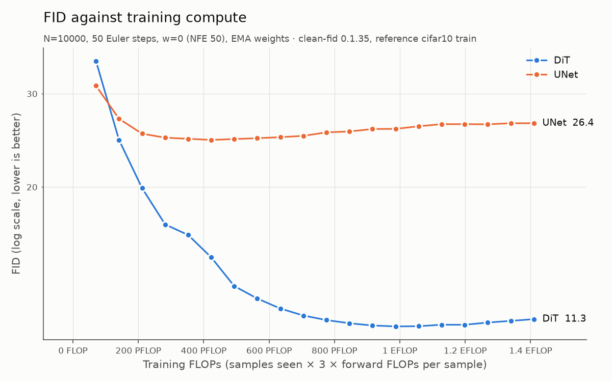
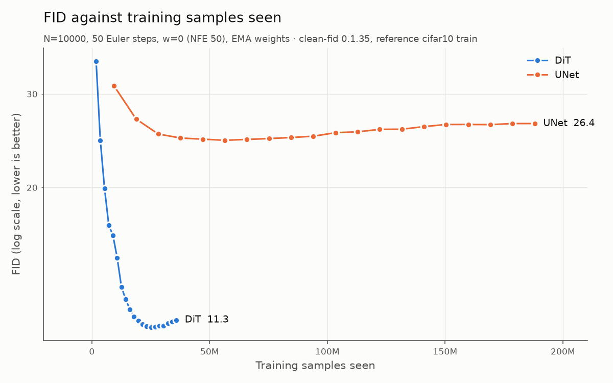
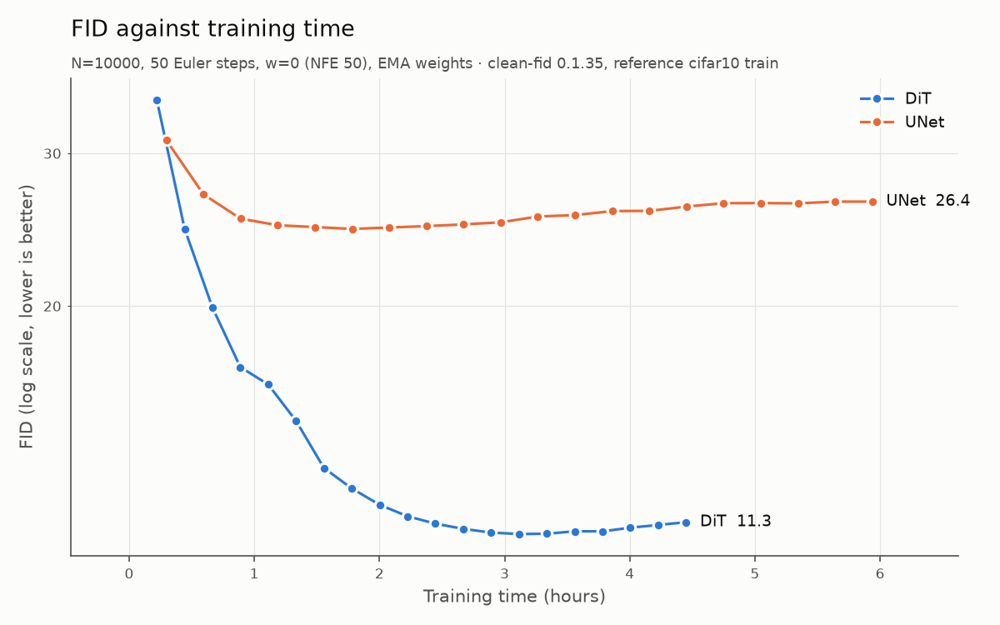
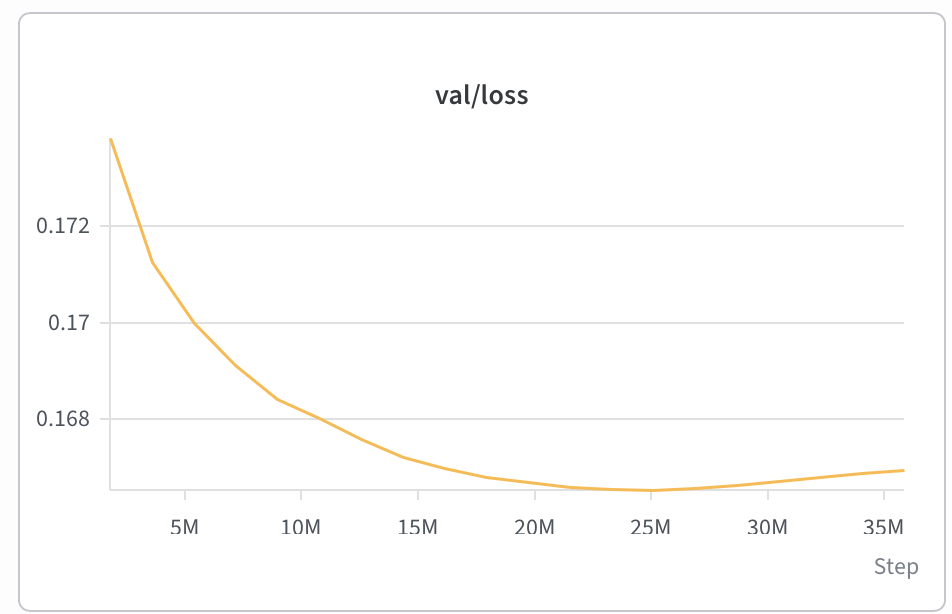
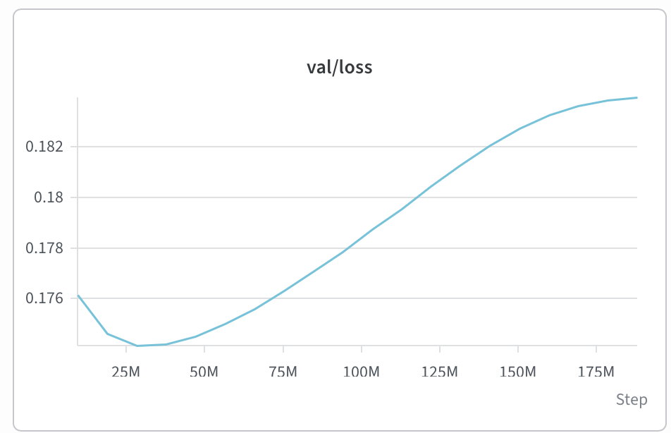
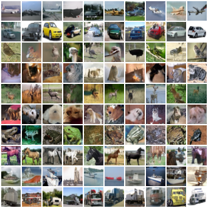
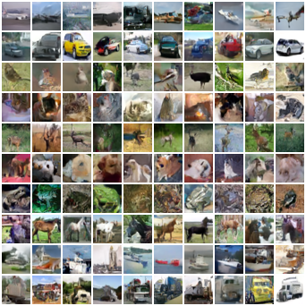
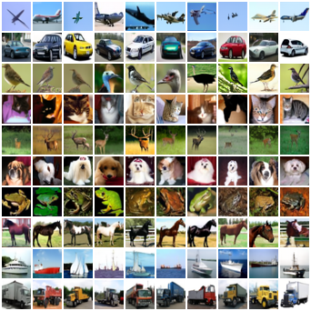
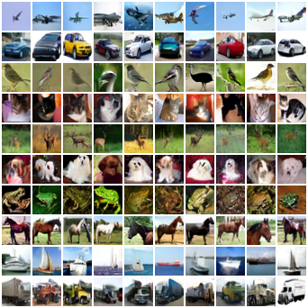

# piccolo-flow-matching

Flow Matching from scratch on CIFAR-10, with a DiT and a UNet compared at equal training compute.

I implemented class-conditional Flow Matching ([Lipman et al., 2022](https://arxiv.org/abs/2210.02747)) in PyTorch: the training objective, the ODE sampler, classifier-free guidance and both networks. The question is simple. Given the same training FLOPs, which backbone produces better samples? The answer turned out to be clear, and along the way the experiments said a few interesting things about overfitting, guidance and sampling steps.

## Results at a glance

| Backbone | Params | FID, checkpoint selected by val loss | FID, end of training |
|---|---|---|---|
| DiT | 35.2M | **8.83 ± 0.04** | 9.13 ± 0.02 |
| UNet | 36.8M | 23.25 ± 0.21 | 24.23 ± 0.19 |

FID on 50k samples, 50 Euler steps, no guidance. Mean and standard deviation over 3 evaluation seeds. Both models trained with the same compute (1.41 EFLOP).



- **At equal compute the DiT is far ahead.**
- **The gap does not depend on how "equal" is defined.** At the same number of training samples (about 36M) it is 11.3 against 24.8 (FID on 10k samples).
- **With very little compute the UNet is better.** The DiT overtakes it between the first and the second snapshot, around 100 PFLOP. That is what the convolutional inductive bias would predict.
- **Both models start overfitting after about 500 epochs.** The UNet is 5x cheaper per sample, so at equal compute it goes through 3,767 epochs against 718 for the DiT, and spends most of its budget overfitting.

## What is implemented here

From scratch: the Flow Matching objective, the Euler sampler, classifier-free guidance, the DiT, the UNet, the training loop and the evaluation protocol.

Not from scratch: FID is computed with [clean-fid](https://github.com/GaParmar/clean-fid), and CIFAR-10 is loaded with torchvision.

## Method

The conditional path is the optimal transport one from Lipman et al. with `σ_min = 0`, which makes it identical to Rectified Flow. Time goes from noise (`t = 0`) to data (`t = 1`).

```
x_0 ~ N(0, I),   x_1 ~ data,   t ~ U[0, 1]
x_t    = (1 - t) * x_0 + t * x_1
target = x_1 - x_0
loss   = || v_θ(x_t, t, y) - target ||²
```

Sampling integrates `dx/dt = v_θ(x, t, y)` from `t = 0` to `t = 1` with explicit Euler. Guidance is applied to the velocity, `v = (1 + w) v(x, t, y) - w v(x, t, ∅)`, with the class dropped 10% of the time during training. The network sees `1000 t` through a sinusoidal embedding. All evaluations use EMA weights (decay 0.9999 with warm-up).

## Models

| | DiT | UNet |
|---|---|---|
| Parameters | 35.16M | 36.80M |
| Forward GFLOPs per sample | 13.12 | 2.50 |
| Training throughput (samples/s) | 2,294 | 9,029 |
| Training time | 4.45 h | 5.94 h |

Throughput measured on one A100 with batch 256, bf16 autocast, `torch.compile` and the dataset kept on the GPU.

**DiT.** Essentially DiT-S/2 ([Peebles & Xie, 2022](https://arxiv.org/abs/2212.09748)): patch size 2 (256 tokens), hidden size 384, 6 heads, MLP 1536, adaLN-Zero conditioning and fixed 2D sin-cos positional embeddings. I used 13 blocks instead of 12 to bring the parameter count within 5% of the UNet.

**UNet.** A plain convolutional UNet with the usual concatenation skip connections between encoder and decoder, GroupNorm, SiLU and FiLM conditioning, channels from 64 to 1024. Inside each level there are **no residual blocks and no self-attention**, so it is simpler than the UNets used in DDPM and ADM. Keep this in mind when reading the results: this is a comparison between these two networks, not between UNets and transformers in general.

## Protocol

**Equal compute.** Training FLOPs are counted as samples seen × 3 × forward FLOPs. The DiT costs 5.25x more per sample, so the UNet trains for 5.25x more iterations: 734,480 against 140,000, both at batch 256. Each run saves 20 snapshots at the same FLOPs, so the curves can be compared point by point. The same snapshots also give the comparison at equal samples seen and at equal training time.

**Learning rate.** Each backbone got its own sweep, with the same tuning budget in FLOPs (10% of the long run). The learning rate is kept constant after 1,000 warm-up steps, so that short runs compare learning rates and not schedules. The selection rule (val loss and FID on 5k samples, FID wins if they disagree) was written down before looking at the results. The first grid had the winner on the edge, so I extended it to 3e-3.

| Learning rate | 1e-4 | 3e-4 | 1e-3 | 3e-3 |
|---|---|---|---|---|
| DiT val loss / FID | 0.1753 / 44.4 | 0.1725 / 34.4 | **0.1713 / 29.2** | 0.595 / 345 (diverged) |
| UNet val loss / FID | 0.1758 / 32.0 | 0.1748 / 29.9 | **0.1747 / 29.3** | 0.1751 / 29.0 |

For the UNet the last three values are within evaluation noise (I checked with 3 seeds), so the tie rule fixed in advance picked 1e-3, the middle of the flat region. Both backbones therefore use 1e-3. The DiT is very sensitive to the learning rate, while the UNet barely notices it.

**Training.** AdamW without weight decay, gradient clipping at 1.0, 1,000 warm-up steps, cosine decay from 1e-3 to 1e-5, bf16 autocast, no dropout.

**Evaluation.** clean-fid 0.1.35 in `clean` mode, against the CIFAR-10 train set statistics, with class-balanced samples. Training curves use 10k samples, headline numbers 50k. Before trusting the numbers I checked the tool on known answers: the CIFAR-10 test set against the train statistics gives 3.24, and an untrained model gives 464. The evaluation noise is about 0.2 FID at 5k samples.

**Checkpoint selection.** The "selected" checkpoint is the one with the lowest validation loss, not the lowest FID. Picking the best FID and then reporting it would be optimistic by construction. The selected checkpoints are step 98,000 for the DiT and step 110,172 for the UNet.

## Results

### Training curves





The DiT wins on all three axes. Against samples seen the picture is even clearer, because the UNet needs far more data to reach its best point and never gets close.

### Overfitting





The validation loss reaches its minimum at about 25M samples for the DiT and 28M for the UNet, that is after roughly 500 epochs in both cases. After that the training loss keeps going down while the validation loss goes up. The limit is the size of the dataset (50k images), not the model.

This is also a weakness of equal-compute comparisons on small datasets: the cheaper model repeats the data more often. The comparison at equal samples seen controls for it, and the conclusion does not change. The cost of overfitting is visible in the table above: 1.0 FID for the UNet and 0.3 for the DiT, between the selected and the final checkpoint.

Even on the training objective the DiT is better: 0.1666 against 0.1750 at the minimum of the validation loss (same validation data, noise and timesteps for both).

### Sampling steps

FID on 10k samples, final checkpoints, no guidance.

| Euler steps | 1 | 2 | 5 | 10 | 25 | 50 | 100 |
|---|---|---|---|---|---|---|---|
| DiT | 317.6 | 137.8 | 31.5 | 17.8 | 12.3 | 11.3 | 11.1 |
| UNet | 303.9 | 131.1 | 40.3 | 28.9 | **25.8** | 26.4 | 27.4 |

The DiT has converged at 50 steps. The UNet is not monotonic: its best FID is at 25 steps, and integrating more accurately makes it worse. I don't have a solid explanation for this. The ranking is the same whatever number of steps you pick.

With a single step both models get the same score. That is expected: at `t = 0` the optimal velocity points to the class mean, so one Euler step returns the average image of the class, whatever the network.

### Guidance

FID on 10k samples, final checkpoints, 50 Euler steps (100 network evaluations with guidance).

| w | 0 | 0.5 | 1 | 2 | 3 |
|---|---|---|---|---|---|
| DiT | 11.3 | **7.4** | 8.1 | 13.0 | 18.0 |
| UNet | 26.4 | 19.1 | 16.3 | **14.9** | 16.1 |

Guidance helps both, but the optimum differs: 0.5 for the DiT, 2 for the UNet. The weaker model wants stronger guidance. Even with its best guidance, the UNet stays about 2x behind.

### Samples

Samples from the checkpoints selected by validation loss, the same ones published on the Hub. One row per class, with the same initial noise with and without guidance. Without guidance:

| DiT | UNet |
|---|---|
|  |  |

With `w = 3`, starting from the same noise, colours get saturated and samples within a class look more alike. That loss of diversity is what FID penalises.

| DiT | UNet |
|---|---|
|  |  |

## Engineering notes

A few things that cost me time and are worth knowing.

- **TF32 is not symmetric by default.** PyTorch enables TF32 for convolutions but not for matrix multiplications. Until I set `torch.set_float32_matmul_precision("high")` in the evaluation script, the DiT was generating 2.3x slower than it should, and the two backbones were evaluated at different precisions. I noticed because the UNet was running faster than the A100 fp32 peak and the DiT was not.
- **The data loader was the UNet's bottleneck.** Loading images one at a time in Python kept the GPU at about 50% utilisation with the UNet, whatever the batch size. Keeping CIFAR-10 on the GPU as a uint8 tensor brought it to 99% and almost doubled throughput.
- **Counting FLOPs depends on the device.** `FlopCounterMode` does not see fused attention kernels, which happens on CPU and on MPS under `no_grad`. The DiT came out at 11.8 GFLOPs instead of 13.1. The count is now done on CPU with the math attention backend forced.
- **Batch size matters only for the cheap model.** Going from 128 to 256 gave +6% samples/s for the DiT, already compute bound, and +23% for the UNet.
- **One `.item()` per step is enough to stall the pipeline.** Reading the loss at every micro-step synchronises the device and prevents data loading from overlapping with compute. Losses are now read only when logging.

## Limitations

- One training run per backbone. The error bars cover evaluation noise only, not training variance.
- The UNet is a simple one (see above). A UNet with residual blocks and attention would very likely do much better.
- Equal compute on a 50k-image dataset means very different numbers of epochs, and both models overfit. No dropout or other regularisation was used.
- The budget is smaller than in the paper (391k iterations at batch 256 for CIFAR-10). Here the DiT saw about a third of those samples.
- Euler only. The number of steps (50) was fixed before running the step sweep. It is the right choice for the DiT, while the UNet would do slightly better with 25.
- Learning rate sweeps are short and at constant learning rate. Short runs tend to favour higher learning rates.
- The validation set is the CIFAR-10 test split, while FID uses the train split as reference, so checkpoint selection does not touch the FID reference. FID against the train set does not penalise memorisation, which I did not check.
- Training curves use 10k samples and headline numbers 50k. The two are not comparable, since FID is biased upwards at smaller sample sizes.

## Future work

A UNet with residual blocks and self-attention, dropout, several training seeds, logit-normal timestep sampling, higher-order or adaptive solvers, reflow and minibatch OT coupling.

## Reproducing

Python 3.14 on one A100. Install the CUDA build of PyTorch first, then the rest:

```bash
pip install torch==2.14.0 torchvision==0.29.0 --index-url https://download.pytorch.org/whl/cu130
pip install -r requirements.txt
```

clean-fid 0.1.35 needs scipy < 1.18, which is pinned in `requirements.txt`.

The whole pipeline, in order:

```bash
bash run_smoke.sh       # sanity checks: FID on known answers, short training runs
bash run_sweep.sh       # learning rate sweeps
bash run_sweep_fid.sh   # FID of the sweep checkpoints
bash run_long.sh        # the two long runs
bash run_eval.sh        # training curves, final FIDs, step and guidance sweeps
bash run_eval_b.sh      # FID at 50k with 3 seeds, selected and final checkpoints
```

Each run has its own config in `configs/runs/`. Throughput was measured with separate 600-step runs, same settings as the long runs. Sweeps, long runs and evaluation together cost just under 30 USD of GPU time.

## Checkpoints

The two selected checkpoints (EMA weights, with the backbone config inside) are on the Hugging Face Hub: [antonioagostino/piccolo-flow-matching](https://huggingface.co/antonioagostino/piccolo-flow-matching).

To evaluate one:

```bash
python -m src.evaluate --config configs/runs/long_dit.yaml --snapshot-dir path/to/dit \
  --num-samples 50000 --n-steps 50 --guidance 0 --seed 0
```

## References

- Lipman et al., *Flow Matching for Generative Modeling*, 2022
- Liu, Gong & Liu, *Flow Straight and Fast: Learning to Generate and Transfer Data with Rectified Flow*, 2022
- Peebles & Xie, *Scalable Diffusion Models with Transformers*, 2022
- Ho, Jain & Abbeel, *Denoising Diffusion Probabilistic Models*, 2020
- Ho & Salimans, *Classifier-Free Diffusion Guidance*, 2022
- Parmar, Zhang & Zhu, *On Aliased Resizing and Surprising Subtleties in GAN Evaluation*, 2022